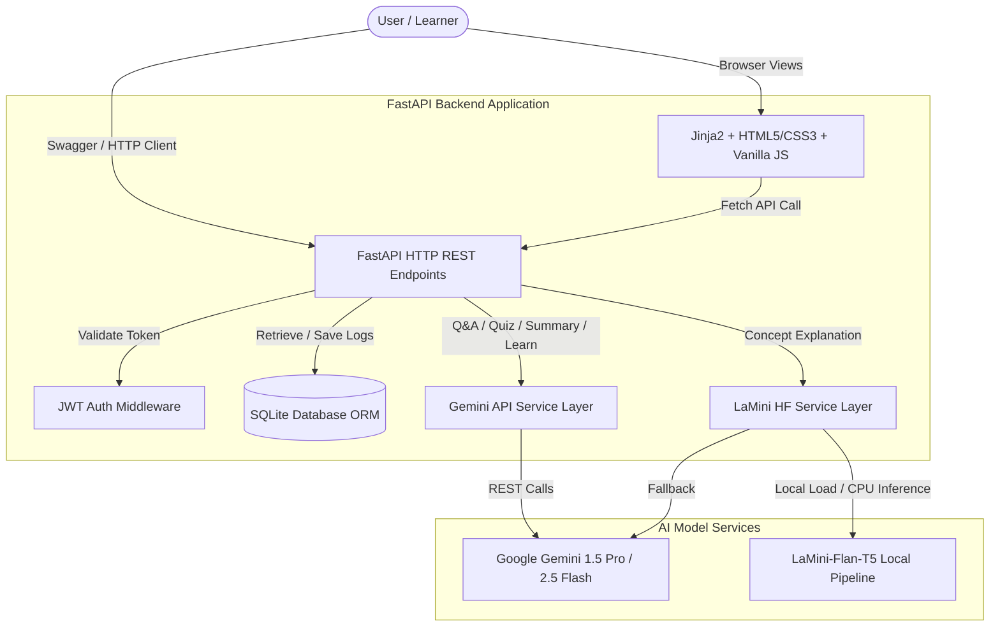
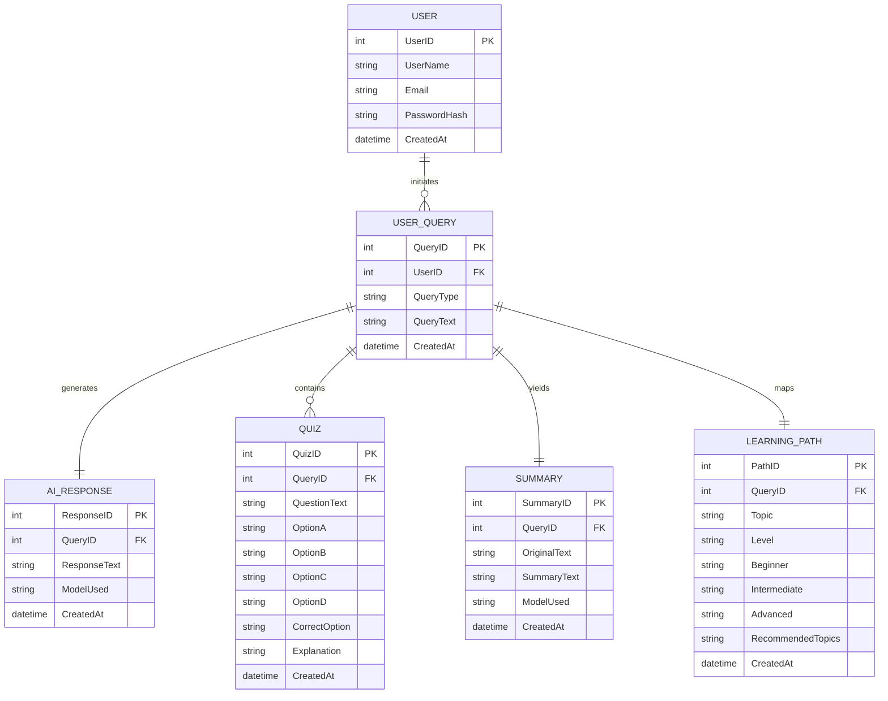

# EduGenie: Google Gemini Powered AI Learning Assistant

EduGenie is a lightweight, production-ready AI-powered educational assistant designed to simplify learning experiences. It leverages Google Gemini 1.5 Pro and a CPU-optimized local HuggingFace LaMini-Flan-T5 model to help students, teachers, self-learners, and educators query concepts, test knowledge, summarize study notes, and construct roadmaps.

---

## System Architecture



---

## Entity-Relationship (ER) Diagram



---

## Core Features & Module Endpoints

1. **Authentication Router (`/api/auth`)**
   - `POST /signup`: Register a new student account.
   - `POST /login`: Verify credentials, generate JWT, and set HTTP-only cookie.
   - `POST /logout` & `GET /logout-redirect`: Invalidate JWT sessions.
   - `GET /me`: Retrieve details of current active session.

2. **Q&A Module (`POST /api/modules/qa`)**
   - **Model**: Gemini 1.5 Pro / Flash.
   - **Input**: Question text.
   - **Output**: Detailed Answer, list of Related Concepts, and Additional Historical/Analogical Context.

3. **Explanation Module (`POST /api/modules/explain`)**
   - **Model**: LaMini-Flan-T5 (local) with Gemini fallback.
   - **Input**: Jargon/topic term.
   - **Output**: Plain-text definition, illustrative examples, real-world applications, and brief summary.

4. **Quiz Module (`POST /api/modules/quiz`)**
   - **Model**: Gemini 1.5 Pro.
   - **Input**: Topic, Difficulty, and Question count.
   - **Output**: Structured list of multiple-choice questions with options, correct answer, and explanation.

5. **Summary Module (`POST /api/modules/summarize` & `/summarize/pdf`)**
   - **Model**: Gemini 1.5 Pro.
   - **Input**: Paste notes OR upload study PDF files.
   - **Output**: Summary paragraph, key takeaways, formulas, terminology definitions, and study tips.

6. **Learning Path Module (`POST /api/modules/learn/recommendations`)**
   - **Model**: Gemini 1.5 Pro.
   - **Input**: Skill or subject name.
   - **Output**: Beginner, Intermediate, and Advanced timelines (including subtopics, project ideas, resources, certifications, and career recommendations).

---

## Quick Start Guide

### Prerequisites
- Python 3.10+ installed
- Google Gemini API Key (optional for local mock run, required for full AI generation)

### Option A: Running Locally

1. **Clone the repository** and navigate to the directory:
   ```bash
   cd EduGenie
   ```

2. **Set up environment variables**:
   Create a `.env` file from the example:
   ```bash
   cp .env.example .env
   ```
   Open `.env` and fill in your `GEMINI_API_KEY`. If empty, the app runs in simulated demo mode.

3. **Create and activate a virtual environment**:
   ```bash
   python -m venv .venv
   # Windows:
   .venv\Scripts\activate
   # Linux/macOS:
   source .venv/bin/activate
   ```

4. **Install dependencies**:
   ```bash
   pip install -r requirements.txt
   ```

5. **Run the FastAPI server**:
   ```bash
   .venv\Scripts\python -m uvicorn backend.app.main:app --reload

   ```
    Open [http://localhost:8000](http://localhost:8000) in your browser.

---

## Testing

Run automated API and routing unit tests:

```bash
# Activate virtual environment and run pytest
pytest -v
```

---

## Deployment Guide

### Backend (Render)
1. Fork/push this repository to GitHub.
2. Log in to [Render](https://render.com/) and create a new **Web Service**.
3. Select this repository. Set the following details:
   - **Runtime**: `Python 3`
   - **Build Command**: `pip install -r requirements.txt`
   - **Start Command**: `uvicorn backend.app.main:app --host 0.0.0.0 --port $PORT`
4. Add environment variables under the service's "Env" settings:
   - `GEMINI_API_KEY`: Your Google Gemini API Key.
   - `SECRET_KEY`: A secure JWT signature key.
   - `DATABASE_URL`: `sqlite:///./edugenie.db` (or a PostgreSQL connection string).

### Frontend (Vercel)
If you deploy the frontend separately, you can host static components on Vercel and direct AJAX requests to your Render API server URL. However, the preconfigured template version runs together out of the box on Render.
